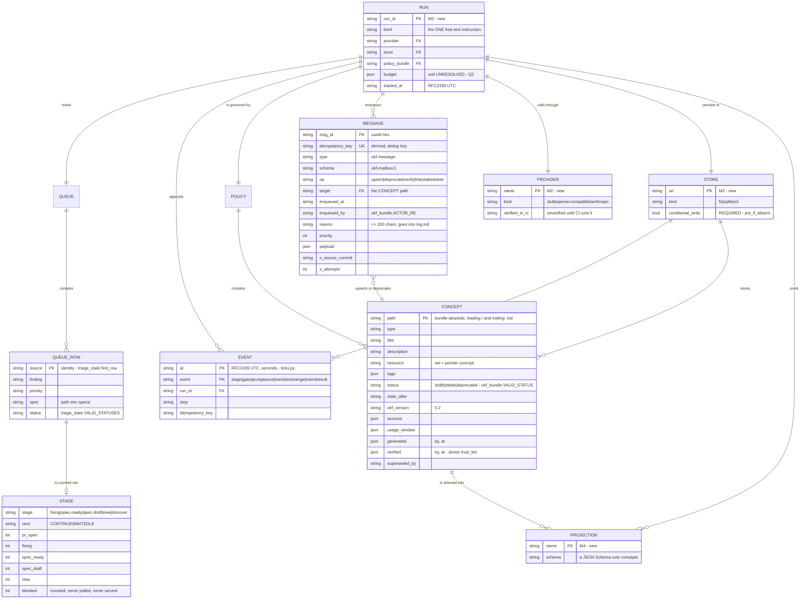

# LoopKit runtime — domain model and ERD

- Spec: `specs/loopkit-runtime.md` · Plan: `docs/research/runtime-plan.md` §2 (M1)
- ADRs: `docs/adr/0001` … `0004`

The owner's epic gate requires the domain model mapped to an ERD before any
implementation PR. This is that map.

**Every field name below is what the existing code actually writes.** Where an
entity exists today, the source of the names is cited by symbol. Where an entity
is new in M2 or M4, it is marked so — a field that has never been written by
anything is a proposal, and it says so.

## Cardinalities, and why each is what it is

**RUN — QUEUE (1:1).** A Run reads exactly one Queue. Not zero: a Run with no
Queue has nothing to advance. Not many: two Queues would need a merge rule and a
precedence between them, and neither exists.

**RUN — EVENT (1:many, ordered, append-only).** Zero Events is legal only before
the `run_start` Event is written, which is the first thing a Run does. The
ordering is the journal, and the journal is the durability substrate (ADR-0003) —
so Events are appended and never updated or deleted.

**RUN — POLICY (1:1).** One bundle per Run. An empty bundle is legal and means
zero enforceable Concepts; it must not be read as "unscoped".

**RUN — MESSAGE (1:many, optional).** A Run that proposes no knowledge enqueues
no Messages. This is the *only* write path into the bundle (ADR-0002).

**RUN — PROVIDER, RUN — STORE (1:1 each).** One of each per Run, injected. Two
Providers in one Run would make the journal ambiguous about who produced a
result; two Stores would split the journal, which defeats resume.

**RUN — PROJECTION (1:many, optional, read-side).** A caller asks for zero or
more named Projections. Nothing in a Run's execution depends on them.

**QUEUE — QUEUE_ROW (1:many).** Identity is `source`, so a Queue cannot hold two
rows with one `source` — `triage_state.find_row` matches on it and `upsert_row`
updates rather than appends.

**QUEUE_ROW — STAGE (many:0-or-1).** Every row is *counted*; only rows at the
four work statuses are counted into a served Stage. A row at `pr-open`, `blocked`,
`inbox` or `done` contributes to the counts and to nothing else.

**POLICY — CONCEPT (1:many).** A bundle holds zero or more Concepts.
`index.md` and `log.md` are reserved and generated, so they are not Concepts.

**MESSAGE — CONCEPT (many:1).** Many Messages over a Concept's lifetime — an
`upsert`, later a `verify`, eventually a `deprecate`. `link` is the exception
that carries `from`/`to` in its payload instead of a single `target`.

**CONCEPT — PROJECTION (many:many).** A Concept may appear in several
Projections, and a Projection selects several Concepts. A Concept in no
Projection is simply not visible to that caller — the "limited graphs per
division" requirement.

**STORE — EVENT, STORE — CONCEPT (1:many each).** The Store is the persistence
boundary for both. Its `put_if_absent` is what makes two writers safe (ADR-0003).

## The entities in prose

**Run.** One supervisor invocation. It carries a brief, a budget, and the three
injected things — Provider, Store, Policy. `run_id` is its identity and the key
resume looks up. **Whether `run_id` is caller-supplied or runtime-generated is
unresolved (Q1/Q2 in the spec's open questions), and it changes what "the same
Run" means to an API caller.** New in M2; every field above is a proposal.

**Queue row.** One finding. Exactly five columns — `finding`, `source`,
`priority`, `spec`, `status` — because that is `triage_state.COLUMNS` and this
model describes what exists rather than a tidier thing beside it. `source` is
the identity: a GitHub URL, an issue reference, whatever names the finding
uniquely. `status` is drawn from `triage_state.VALID_STATUSES`; an unknown value
raises rather than being coerced.

**Stage.** Not a stored entity — a derived value, the output of a pure lookup
over the counts. It is drawn in the ERD because it is a domain concept with a
fixed vocabulary, not because a row of it exists anywhere. Precedence is `fixing
> spec-ready > spec-draft > new`, falling through to `discover`. The paired
`next` is the sleep decision: `CONTINUE` when work remains here, `WAIT` when
something outside must move first, `IDLE` when the queue is genuinely empty.
Conflating the last two is what makes a loop sleep on an empty queue.

**Event.** One append-only journal line, as `ticks.py` writes it: `at` in
RFC3339 UTC at second precision, `event` naming the kind, then flat fields. The
existing kinds are `stage`, `gate`, `acceptance`, `transition` and `merge`; the
runtime adds `run_start`, `intent`, `result`, `provider_error` and
`budget_exhausted`. `intent` and `result` are the durability pair — everything in
ADR-0003 is about the gap between them. Note `ticks.py` is fail-open by design:
a ledger write can never change a verdict, so it exits 0 on every path. That is
correct for a metrics ledger and **not** sufficient for a durability journal; the
runtime's journal writes must fail loudly, which is a behaviour change M2 owns.

**Concept.** One OKF file: `path`, `frontmatter`, `body`, exactly
`okf_bundle.Concept`. The frontmatter keys are listed in
`okf_bundle.CANONICAL_KEY_ORDER` and emitted in that order, so output is stable
whatever order a Message supplied. `status` is `draft | stable | deprecated`.
`trust_tier` is *derived*, never stored: no `verified` means `unverified`, a
`verified.by` starting `human:` means `human-reviewed`, anything else means
`machine-confirmed`. That derivation is the whole trust gate (ADR-0002).

**Message.** The mailbox envelope, exactly as `knowledge_actor.build_message`
writes it. `idempotency_key` is derived from `(op, target, body, payload)` and is
the dedup key; `msg_id` is a fresh uuid4 per enqueue and is *not*. Six ops.
`enqueued_by` must match `okf_bundle.ACTOR_RE` — `human:<id>`, `process:<id>` or
`<producer>/<version>` — and that prefix is what the draft gate reads. A message
failing validation is dead-lettered on the first pass, never retried, because a
malformed envelope will not fix itself.

**Projection.** A named JSON Schema over Concepts plus the JSON emitted for it.
Omission is the point: a caller sees the concepts its projection names and no
others. New in M4.

**Provider.** Anything implementing `complete(messages, tools, response_schema)
→ {text, tool_calls, usage}`. `verified_in_ci` is a field rather than a README
sentence because a provider nobody has run is the easiest thing in this design to
claim (pre-mortem row 2). New in M2.

**Store.** Anything implementing `put_if_absent / get / append / list`.
`conditional_write` is not a capability flag to branch on — it is a *requirement*.
A store without an atomic `put_if_absent` cannot implement the contract and is
refused rather than degraded. Reference kinds are filesystem, SQLite and
S3-compatible. There is no Postgres kind, by owner ruling. New in M2.
